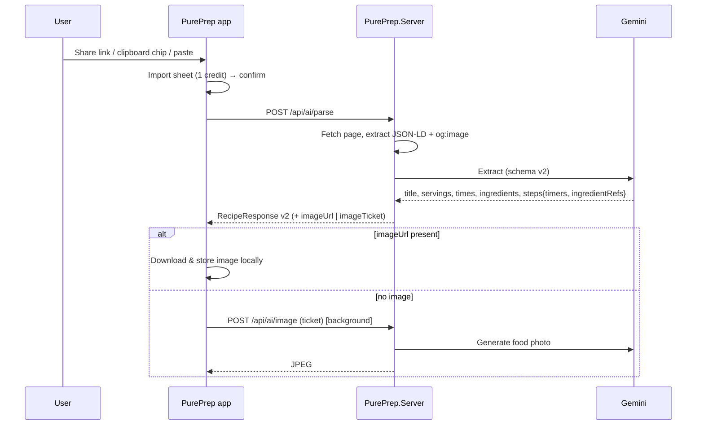

# PurePrep 1.4 — Design

- **Date:** 2026-09-24
- **Status:** Approved (brainstorm), pending spec review
- **Target:** Android, version 1.4.0

## 1. Intent

The maintainer's own list after using 1.3.3 daily, plus findings from a full click-through on a Pixel 10:

- Getting a recipe *into* the app should be effortless: share from any app, or open the app with a link on the clipboard.
- Since the LLM already reads the recipe, it should also understand it: name timers, know how many people it serves, know which ingredients each step uses.
- Scaling should be by **people**, not multipliers.
- Fix what is broken or awkward: Read Step cannot be stopped, clipped switches, misaligned top bar, emoji icons, the one-per-line editor, the unused ingredient checklist.
- Add "cookbook" features: photos, times, notes, Want to cook / Cooked, favourites, sorting, a running-timers bar.

All of it ships in **one release (1.4)** — the maintainer's explicit choice.

**Success looks like:** share a link from Chrome while on any screen → one tap → recipe with photo, servings, named timers and per-step ingredients; cook it end-to-end in Focus Mode without fighting any control.

## 2. Findings from the click-through (1.3.3, versionCode 24)

| # | Finding | Root cause |
|---|---|---|
| F1 | Sharing a link seems to do nothing | `SharedUrlRelay` only fills the library page's URL box; when another page is on top nothing visible happens, and an Import tap is still required. |
| F2 | No clipboard auto-detect | Clipboard read only on the 📋 button. |
| F3 | Timers: "10-12 mins" → "12 mins", manual naming dialog on every start, dialog backdrop renders solid black | Regex `StepTimers`; naming prompt in Focus page. |
| F4 | ½×/1×/2×/3× plus redundant "Scale 1×" label | `ServingsDetector` exists but isn't used by the scaler. |
| F5 | Read Step cannot be deactivated | Button always calls `SpeakCurrentStep(force: true)` — no stop state. Auto-read toggle is a clipped, near-invisible switch. |
| F6 | All `Switch` controls render clipped ("half pill") | Global style/size issue. |
| F7 | Recipe-detail top bar centred, back button grouped with actions; mismatched emoji icons (🌐 ✏️ 🗑️); delete next to edit | Detail page layout differs from every other page. |
| F8 | Editor: fixed-height text boxes that scroll internally; wrapped lines look like separate steps; no reorder | `Editor` controls with one-per-line parsing. |
| F9 | Focus-mode ingredient checklist not useful | Remove for now (returns with a future pantry feature). |
| F10 | Library card badge duplicates step count | Low-value visual. |
| F11 | "Ingredients not in your units?" hint on every recipe; "designed dark-first" copy shown in Light | Unconditional copy. |

## 3. Architecture decision

**Approach A — one enriched parse call** (chosen over a separate enrichment call or on-device heuristics).

The Gemini response schema is extended so a single call returns all structured data. Contracts change **additively only**, so 1.3.x clients keep working against the new server. On device, new data is stored as new columns plus richer `StepsJson`. Legacy recipes fall back to existing regex detectors.



## 4. Import

### 4.1 Share from anywhere
- `MainActivity` keeps publishing to `SharedUrlRelay`; the relay subscriber moves from `MainPage` to an app-level handler (`AppShell`/`App`) so it reacts on any page.
- Shows an **Import sheet** over the current page: domain, full URL, "Uses 1 Smart Credit · you have N", *Import* / *Cancel*.
- If the URL is already in the library: "Already saved" with *Open it* / *Import again*.
- On *Import*: navigate to the library, show progress, then open the new recipe's detail page.
- Cold start keeps the existing `TakePending()` path, routed to the same sheet.
- Explicit confirm is kept deliberately — an import spends a credit.

### 4.2 Clipboard suggestion
- On every app resume, read the clipboard once. If it holds a URL (`SharedText.ExtractUrl`) that is not already saved and not equal to the last suggested URL (persisted preference), show a chip above the URL box: "🔗 domain/…  Import?". Tapping it opens the same Import sheet; ✕ dismisses.
- Android 12+ shows the system "pasted from clipboard" toast — accepted.
- 📋 manual paste button remains.

## 5. Parser v2 (server)

### 5.1 Schema
```json
{
  "title": "string",
  "servings": "integer|null",
  "servingsNoun": "string|null",      // "people", "pancakes", "slices"
  "servingsEstimated": "boolean",
  "prepMinutes": "integer|null",
  "cookMinutes": "integer|null",
  "ingredients": ["string"],
  "steps": [{
    "text": "string",
    "ingredientRefs": ["integer"],     // 0-based indexes into ingredients
    "timers": [{ "label": "string", "minSeconds": "integer", "maxSeconds": "integer" }]
  }]
}
```

### 5.2 Prompt rules (added to `SystemPrompt`)
- Timer labels: 2–4 words, in the output language, describing the action ("Fry onion", "Rest dough"). Only for durations the cook waits on or cooks for — never for vague phrases ("season to taste").
- Ranges: `minSeconds`/`maxSeconds`; single values set both equal.
- Servings: use the source's stated yield; if absent, estimate from quantities and set `servingsEstimated = true`. `servingsNoun` for piece-counted yields.
- `ingredientRefs`: every ingredient the step uses; empty if none.
- Times: from the source; null when not stated (no guessing).

### 5.3 Image source
- Server picks `imageUrl` from JSON-LD `Recipe.image`, else `og:image`; validated with `UrlGuard`. Never from the LLM.
- When none is found (and for text imports), the response includes `imageTicket`.
- Photo imports: the uploaded photo is not stored as the recipe image (it's usually a page scan); a ticket is issued instead.

### 5.4 Contract (additive)
`RecipeResponse` gains: `Servings`, `ServingsNoun`, `ServingsEstimated`, `PrepMinutes`, `CookMinutes`, `ImageUrl`, `ImageTicket`, `StepDetails` (list of `{Text, IngredientRefs, Timers}`). The existing `Steps` (list of strings) stays populated for 1.3.x clients.

### 5.5 Translation
`TranslateRequest`/`Response` carry timer labels and servings noun; the model must keep the step count, timer count, durations and `ingredientRefs` unchanged. The client re-attaches structure by index and rejects a translation whose step/timer counts differ (retry once, then fail gracefully with the existing error codes).

### 5.6 AI image endpoint
- `POST /api/ai/image { deviceId, ticket, title, ingredients }` → `image/jpeg`.
- Ticket: issued by a successful parse, bound to the device, single use, 10-minute expiry, held in memory (`IMemoryCache`). Lost on restart → generation simply fails.
- **Included in the import credit** (maintainer decision) — no extra charge.
- Prompt: appetising, realistic, top-down plated dish, neutral background, no text. Gemini image model configured in `GeminiOptions` (`ImageModel`).
- Usage logged like parse (token/cost log).

## 6. Recipe detail page

- **Top bar (shared control, used on every page):** ‹ Back left-aligned; actions right. Detail: 🌐 Language, ✎ Edit, ⋯ More (Share recipe, Open original, Delete with confirm).
- **Icons:** Material Symbols Rounded bundled as a font; `IconGlyphs` constants; tinted via theme resources. Replaces all UI emoji (📋 🔊 🎤 ⏱ 🗑 🌐 ✏️ ✎).
- **Header:** 16:9 photo (or placeholder), title, meta line "⏱ 15 min prep · 30 min cook · domain", ♡ Favourite toggle, status chip.
- **Servings scaler:** `Serves [−] 4 people [+]`; range 1–99; tap number → numeric keypad; ↺ reset when changed; "~" prefix when estimated; unknown servings → "Serves ? — set it" with factor stepper fallback. Factor = chosen ÷ original, applied via `RecipeScaling.ScaleRecipe`. `ChosenServings` persisted per recipe and used in Focus Mode.
- **Notes card** between Ingredients and Method; tap to edit, auto-saved; never translated, never sent to the server.
- Unit hint only when `SourceSystem` differs from the user's unit setting.

## 7. Library

- Card: thumbnail (photo or placeholder: tinted tile with the title's initial), title, "30 min · Serves 4", ♥ when favourite, COOK › button.
- Filter chips: All · Want to cook · Cooked · ♥ Favourites.
- Sort menu: Recently added (default), Recently cooked, A–Z. Favourites pinned to top in every view.
- Hero headline collapses to a compact header once the library is non-empty.

## 8. Status: Want to cook / Cooked

- New imports and manual adds: `WantToCook`.
- Finishing the last step in Focus Mode → "Done! Mark as cooked?" (default yes) → `Cooked`, `CookedAt = now`, `CookCount++`.
- Manual change via the status chip.

## 9. Focus Mode

- **Header:** ‹ Back · title + "Step 1 of 13" · ⋯ Cooking options sheet with labelled switches: *Read each step aloud*, *Keep screen on*.
- **Global Switch fix** (F6) — applies to Settings too.
- **"You'll need"** chips under the step card from `IngredientRefs`, scaled to `ChosenServings`. Hidden for legacy recipes.
- **Read step toggle:** ▶ Read step ⇄ ■ Stop. Resets on speech completion, step change, and page disappearing. Voice command "stop" added to `VoiceCommandVocabulary` (all 7 languages).
- **Ingredient checklist removed.** "Ingredients" button opens a read-only list plus notes.
- Notes shown on the first step (collapsible).

## 10. Timers

- Chip: "⏱ Fry onion · 10–12 min". Single tap starts immediately — the naming dialog is removed.
- Range timers count to `minSeconds`, alert "Check now", offer "+2 min" until `maxSeconds`.
- Long-press chip: rename / adjust duration (in-app sheet, not the black-backdrop dialog).
- Legacy recipes: regex timers labelled with the step's first 3 words.
- **Running timers bar:** app-wide overlay at the bottom when any timer runs: "Fry onion 07:42 · Simmer 18:10"; tap → that recipe's step in Focus Mode. Driven by existing `CookTimerService`; Android notifications unchanged.

## 11. Editor

- Replaces the one-per-line `Editor` boxes; page scrolls normally.
- Fields: Title; Serves stepper; Prep/Cook minutes.
- **Ingredients:** one row per item — ⠿ drag handle, inline `Entry`, ✕. "+ Add ingredient". Enter inserts a new row below; pasting multi-line text splits into rows.
- **Method:** numbered cards with multi-line `Editor` per step, drag to reorder, ✕, "+ Add step".
- Structure preservation: reorder/delete ingredients remaps `IngredientRefs`; editing a step's text re-detects timers via regex, keeping the existing LLM label for any timer whose duration still matches.
- Used for both Edit and Add manually.

## 12. Data & migration

- `ParsedRecipe` adds: `Servings`, `ServingsNoun`, `ServingsEstimated`, `PrepMinutes`, `CookMinutes`, `ImagePath`, `Notes`, `Status`, `CookedAt`, `CookCount`, `IsFavourite`, `ChosenServings`.
- `RecipeStep` adds: `Timers` (`Label`, `MinSeconds`, `MaxSeconds`), `IngredientRefs` — serialized inside existing `StepsJson`; old JSON deserializes with empty lists. `RecipeTranslation` steps carry the same shape.
- New scalar columns added via the existing `pragma_table_info` "add if missing" pattern in `SqliteRecipeRepository.EnsureReadyAsync`, with migration tests like the translation-columns ones.
- Images stored under `FileSystem.AppDataDirectory/images/{recipeId}.jpg`; deleted with the recipe.
- Backup format v2 embeds images (base64) and new fields; v1 restores unchanged.

## 13. Error handling

- Parse v2 fields missing/malformed → treat as absent (legacy behaviour), never fail the import.
- `ingredientRefs` out of range → dropped.
- Image download or generation failure → placeholder, silent; no credit impact.
- Translation structure mismatch → one retry, then existing friendly error.
- Clipboard read failure → no chip.

## 14. Testing

xUnit + NSubstitute + FluentAssertions; `MethodName_State_Expected`; AAA.

- **Core:** payload→domain mapping with/without v2 fields; servings-based scaling factor; range timer state; legacy regex fallback labels; `IngredientRefs` remap on reorder/delete; timer label preservation on step edit; backup v1→v2 round-trip; repository column migration.
- **Server:** schema/prompt contract; additive `RecipeResponse` (legacy `Steps` populated); image source selection (JSON-LD > og:image, `UrlGuard`); image ticket single-use / device-bound / expiry; translation structure validation.
- **Device:** manual click-through on the Pixel via adb (share intent, clipboard chip, Focus Mode, editor, timers bar).

## 15. Out of scope (later)

- Pantry / "what's in my kitchen" (the ingredient checklist returns with it).
- Meal planning, shopping list.
- Health Connect / nutrition — see [`docs/superpowers/specs/2026-09-25-health-connect-nutrition-design.md`](2026-09-25-health-connect-nutrition-design.md) for the 1.5 design.
- Re-enriching legacy recipes via the LLM.

## 16. Addendum (2026-09-25, approved during implementation)

### 16.1 Unified bottom-sheet modals
Every dialog (alert, confirm, prompt, choice list) and every custom sheet (Import, cooking options, timer edit, credits) renders as one shared bottom sheet: page stays visible behind a theme-tinted dim that fades in; sheet slides up, full width, 28px top corners, grab handle, theme-matched background, side-by-side buttons that never truncate; destructive actions (Delete) use a red pill/red row. Presentation only — results, cancel and back-button semantics unchanged.

### 16.2 In-app recipe search
- Home: a "Search the web" field (Enter → search).
- `SearchBrowserPage`: shared TopBar (back, current host, ⋯ Open in browser / Try importing this page anyway) and a WebView starting at Google search for "<query> recipe" (Google `hl` = app language). Hardware back navigates web history first.
- After each navigation, injected JS reads `application/ld+json`; a Core parser (`WebRecipeDetector`, pure, unit-tested, tolerant of malformed JSON, reuses the JSON-LD Recipe/@graph walk) decides whether the page is a recipe and extracts title + image URL. No server call, no credit.
- Recipe page → floating "+ Add to PurePrep" pill → existing Import sheet (title/photo preview, cost, duplicate "Already saved · Open it") → existing `ImportUrlAsync` → open the new recipe.
- http(s) only; no extra permissions; the in-app browser never auto-imports.

### 16.3 Sample recipe (Pierogi)
The first-launch sample becomes a full 1.4 recipe: Servings 4 (noun "pierogi" count stated in text), prep/cook minutes, named range timers (Boil potatoes 15–20 min, Rest dough 30 min, Boil pierogi 3–4 min), ingredient refs on each step, an example note, status Want to cook. Placeholder image unless a bundled photo is supplied. Affects only fresh installs (seeding logic unchanged).
